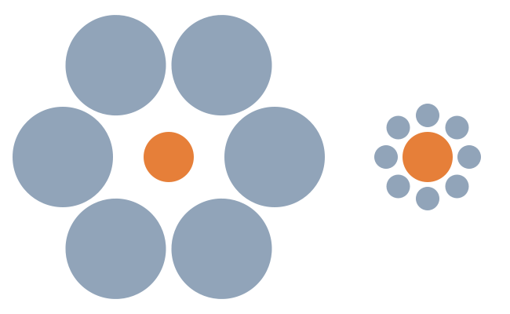

# Decision-making, belief, and behavioral biases

{width=30%,float=right}

**Question: Which of the orange dots is bigger?**

**Answer: They are the same size**

Go ahead, look again to make sure. As you may have already guessed, this is a simple optical illusion.  Your brain is wired to make decisions quicker with the help of shortcuts (what psychologists call heuristics).  Many of our day to day decisions are made the same way. Your brain interprets data such as these images and makes relatively quick (but sometimes incorrect) decision.  These tendencies to think in certain ways are called cognitive biases and they can lead to systematic deviations from a standard of rationality or good judgment, and are often studied in psychology and behavioral economics.

## The ambiguity effect
The ambiguity effect is a cognitive bias where decision making is affected by a lack of information, or "ambiguity." The effect implies that people tend to select options for which the probability of a favorable outcome is known, over an option for which the probability of a favorable outcome is unknown.
